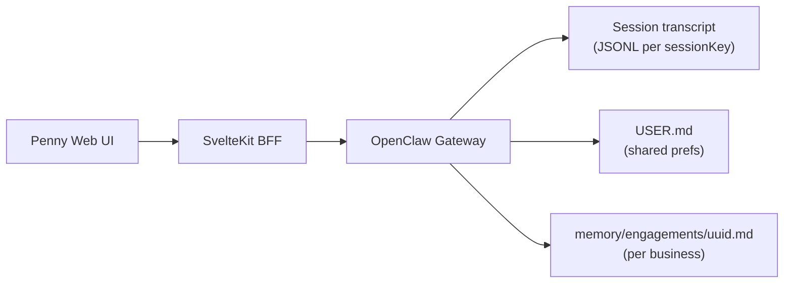

# Penny chat sessions — design spec

**Date:** 2026-05-24  
**Status:** Approved for implementation planning  
**Scope:** ChatGPT-style multi-session UI for Penny (no auth, single local user, multiple business engagements)

---

## Problem

Penny’s web UI currently binds all chat to one OpenClaw session key (`agent:main:main`). A user consulting on multiple businesses (grants, ITC, wage subsidies, etc.) needs separate chats so context does not cross-contaminate and produce wrong eligibility advice.

OpenClaw provides session isolation via `sessionKey` and long-term memory via workspace Markdown files. Transcript isolation is automatic per key; **memory files are workspace-wide by default** and must be scoped deliberately.

---

## Goals

1. **ChatGPT-like sessions** — create, switch, rename, and delete chats from the web UI.
2. **Business isolation** — each engagement’s facts stay in that session’s bucket.
3. **Light shared layer** — user preferences (tone, timezone, name) persist across all chats via `USER.md`.
4. **OpenClaw-native** — use gateway session RPCs and existing memory tools; no auth or multi-tenant DB.

## Non-goals (v1)

- User authentication or multi-user tenancy
- Session search, folders, tags, pinning, export
- Settings UI for editing `USER.md`
- LLM-generated session titles after first reply
- Soft-delete / archive
- Server-side session registry beyond OpenClaw’s session store

---

## Architecture



### Session key scheme

| Key pattern | Purpose |
|-------------|---------|
| `agent:main:penny:<uuid>` | New Penny web chats (one per business engagement) |
| `agent:main:main` | Legacy single chat; shown once as “Previous chat” if it has history |

- UUID is v4, generated client-side or server-side at create time.
- Engagement memory file path is derived from the suffix: `memory/engagements/<uuid>.md`.

### Memory boundaries

| Layer | File | Contents |
|-------|------|----------|
| Shared | `USER.md` | Name, timezone, communication preferences, formatting likes |
| Per engagement | `memory/engagements/<uuid>.md` | Company name, province, industry, revenue band, project, programs discussed, eligibility notes |
| Off limits | `MEMORY.md` | Stub only — no business facts; points agent to engagement files |

**Agent rules** (add to `workspace/AGENTS.md`):

- Write user prefs only to `USER.md`.
- Write business facts only to `memory/engagements/<uuid>.md`, where `<uuid>` is parsed from the current `sessionKey` (`agent:main:penny:<uuid>`).
- Never write business facts to `MEMORY.md` or another engagement’s file.
- Before `memory_search`, restrict mentally to the current engagement file and `USER.md`; do not assume facts from other files apply to this business.

### OpenClaw config guardrails

In `~/.openclaw/openclaw.json` (document in `config/openclaw.penny.example.json5`):

```json5
{
  agents: {
    defaults: {
      memorySearch: {
        sources: ["memory"],
        // Do NOT enable experimental.sessionMemory
      },
    },
  },
}
```

- Keep `memorySearch.sources` as `["memory"]` only — do not add `"sessions"`.
- Do not enable `experimental.sessionMemory` (would index all transcripts into cross-session search).
- Enable bundled `session-memory` hook only if desired for `/reset` archival; engagement files remain the primary per-business store.

### Persistence

| Data | Location |
|------|----------|
| Session list, transcripts, labels | OpenClaw gateway (`sessions.list`, JSONL under `~/.openclaw/agents/main/sessions/`) |
| Active session key | Browser `localStorage` key `penny:activeSessionKey` |
| Engagement memory | `workspace/memory/engagements/<uuid>.md` |

---

## UI behaviour

### Layout

- **Desktop:** ~260px left sidebar + main chat pane (existing max-width ~768px for messages).
- **Mobile:** sidebar as slide-over drawer; hamburger in header.

### New chat

1. User clicks **New chat**.
2. BFF `POST /api/sessions` → `sessions.create({ key: "agent:main:penny:<uuid>" })`.
3. UI switches to new session; empty state; composer focused.
4. Sidebar refreshes; new row at top.

Empty state copy:

> Ask about grants, tax credits, or wage subsidies for **this** Canadian business. Each chat is a separate engagement — facts here won’t mix with your other businesses.

### Session list

- **Source:** `sessions.list` filtered to keys matching `agent:main:penny:*`.
- **Params:** `agentId: "main"`, `includeDerivedTitles: true`, `includeLastMessage: true`, `limit: 50`, `includeGlobal: false`, `includeUnknown: false`.
- **Sort:** `updatedAt` descending.
- **Row title:** `label` → `derivedTitle` → `"New chat"`.
- **Preview:** truncated `lastMessage` (one line, muted).

### Switch session

1. Abort in-flight run if `sending`.
2. Close SSE; update `sessionKey`; persist to `localStorage`.
3. Load `chat.history`; reconnect SSE for new key.
4. Clear composer draft.

### Auto-titles

v1 uses OpenClaw `includeDerivedTitles` (first user message, ~40 chars). No extra LLM call.

### Rename

- Double-click sidebar title or **Rename** in row ⋯ menu.
- `sessions.patch({ key, label })`, max 60 chars.

### Delete

- **Delete** in row ⋯ menu → confirm dialog:

  > Delete this chat? This removes the conversation and any notes Penny saved for this business. This can’t be undone.

- On confirm: `sessions.delete({ key })`; BFF removes `memory/engagements/<uuid>.md` if present.
- If active session deleted: switch to newest remaining, or create new empty chat if list empty.

### Legacy `agent:main:main`

**Migrate once (chosen):** On first load, if `agent:main:main` has messages and no `penny:*` sessions exist, include it in the sidebar as **“Previous chat”**. All new chats use `agent:main:penny:*` only.

### First visit

If no penny sessions and no legacy chat: auto-create first `agent:main:penny:<uuid>` session so the user can type immediately.

### Errors

| Situation | Response |
|-----------|----------|
| Gateway offline | Disable sidebar + chat; show existing health banner |
| Create fails | Toast; stay on current session |
| Switch while streaming | Abort first, then switch |
| Active key missing after refresh | Fall back to newest session or create new |

---

## Backend (SvelteKit BFF)

New routes:

| Method | Path | Gateway RPC | Notes |
|--------|------|-------------|-------|
| GET | `/api/sessions` | `sessions.list` | Filter `agent:main:penny:*`; include derived titles + last message |
| POST | `/api/sessions` | `sessions.create` | Body optional `{ label? }`; server generates uuid + key |
| PATCH | `/api/sessions/:key` | `sessions.patch` | Rename (`label`) |
| DELETE | `/api/sessions/:key` | `sessions.delete` | Also delete engagement memory file |

Existing chat routes unchanged; they already accept `sessionKey` query/body.

### Session service module

Add `web/src/lib/server/session-service.ts`:

- `listPennySessions()` — list + filter + sort
- `createPennySession(label?)` — uuid key creation
- `renamePennySession(key, label)` — patch
- `deletePennySession(key)` — delete transcript + engagement file
- `engagementMemoryPath(sessionKey)` — resolve `memory/engagements/<uuid>.md` from repo workspace root (`PENNY_REPO_ROOT` or config)

Engagement file deletion uses workspace path from env/config (same roots as `penny-tools` plugin).

### Client changes

Extend `ChatClient` / new `SessionClient`:

- `activeSessionKey` from bootstrap (`localStorage` → fallback to newest session → create new)
- `switchSession(key)` — abort, reload history, reconnect SSE
- Sidebar state: sessions list, loading, rename/delete actions

New components (target ≤200 LOC each):

- `SessionSidebar.svelte`
- `SessionRow.svelte`
- `DeleteSessionDialog.svelte`

Update `ChatApp.svelte` to two-column layout.

---

## Workspace changes

1. **`workspace/AGENTS.md`** — memory scoping rules (see Memory boundaries).
2. **`workspace/MEMORY.md`** — create stub:

   ```md
   # Long-term memory (Penny)

   Business-specific facts belong in `memory/engagements/<session-uuid>.md` for the active chat only.
   User preferences belong in `USER.md`.
   Do not store company eligibility, revenue, or project details in this file.
   ```

3. **`workspace/memory/engagements/.gitkeep`** — ensure directory exists.
4. **`config/openclaw.penny.example.json5`** — document memorySearch guardrails.
5. **`docs/penny-local-setup.md`** — note multi-session web UI behaviour.

---

## Data flow (send message)

1. User sends message in active session.
2. `POST /api/chat/send` with `sessionKey`, `sessionId`.
3. Gateway runs Penny agent with isolated transcript + bootstrap (`USER.md`, not cross-engagement files in prompt).
4. Agent may `memory_get` / write engagement file for current uuid.
5. SSE streams deltas to browser scoped by `sessionKey`.

---

## Testing

### Unit

- Session key parsing → engagement memory path
- Session list filter (`agent:main:penny:*` only, legacy row logic)
- `localStorage` active key read/write

### Integration (gateway running)

- Create session → send message → history contains message
- Two sessions: message in A not visible in B’s history
- Delete session → history 404 / empty; engagement file removed
- Rename → label appears in list

### Manual smoke

1. New chat → ask about Ontario SaaS → verify tools run.
2. New chat → ask about BC tourism → confirm no Ontario details in reply unless restated.
3. Switch back to first chat → prior context preserved.
4. Delete second chat → first chat unchanged.

---

## Implementation order

1. Workspace memory rules + stub files + config docs
2. BFF session routes + session service
3. `ChatClient` session switching
4. Sidebar UI (list, new, switch)
5. Rename + delete
6. Legacy migration + first-visit bootstrap
7. Tests + setup doc update

---

## Open questions (resolved)

| Question | Decision |
|----------|----------|
| Auth / multi-user? | No auth; single local user |
| Memory model? | Light shared (`USER.md`) + per-engagement files |
| Legacy main session? | Show once as “Previous chat” |
| Session list source? | OpenClaw `sessions.list`, not browser DB |
| Titles v1? | Gateway `includeDerivedTitles` |
